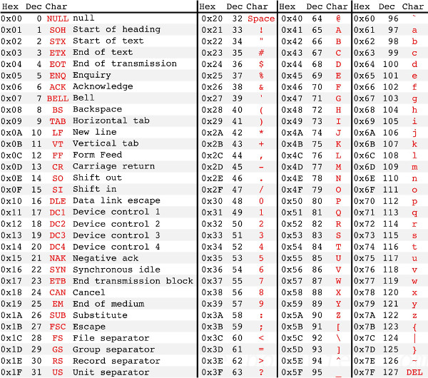
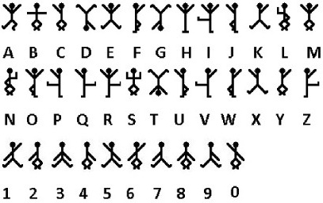
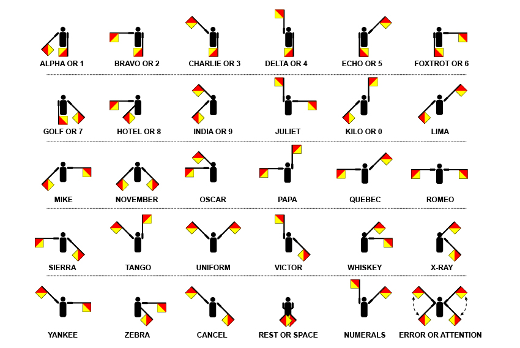

# Alphabets

## Tools

|What|Link|
|----|----|
|Morse decoder |  [http://morsecode.scphillips.com/translator.html](http://morsecode.scphillips.com/translator.html)|
|Morse code explorer if you don't know where the spaces are | http://www.ericharshbarger.org/epp/2010/unmorser.html |
|Morse code explorer if you don't know where the spaces are| http://www.jbowman.com/remorse/ |

Various alphabets / encodings that are commonly used

**Tips and Tricks**

Things like this:

```
(half of a megasecond) squared squared ( (bakers dozen donkeypower (number of horns on a unicorn
once in a blue moon)/ answer to life the universe and everything ) / a beard second squared earth mass)
```
Google can solve for you.

Things like

```
Bama wopa tiwil
Pito loki jifi bati bama
```
are ROILA.

## ASCII



## Braille


## Dancing Men



## Morse code


## Semaphore



## Windings


